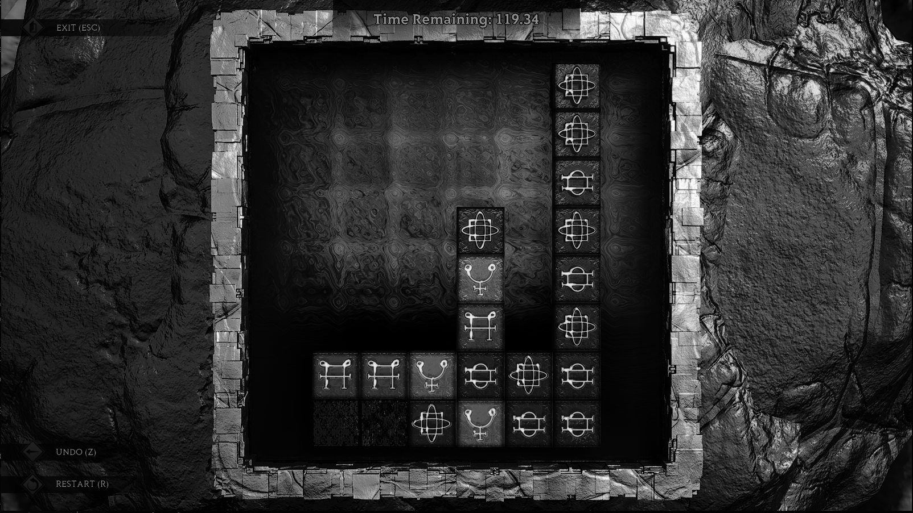
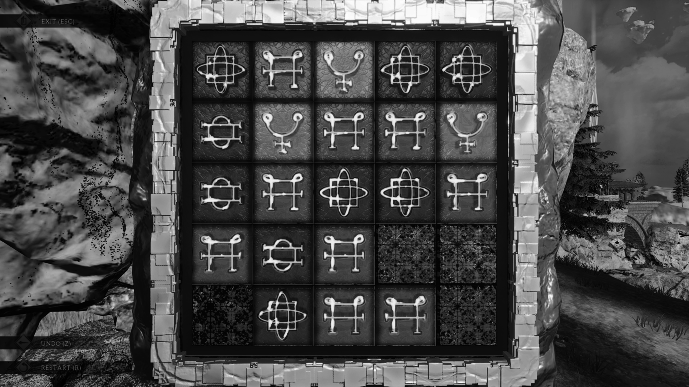
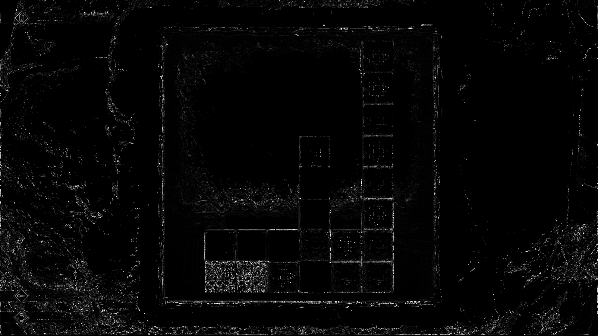
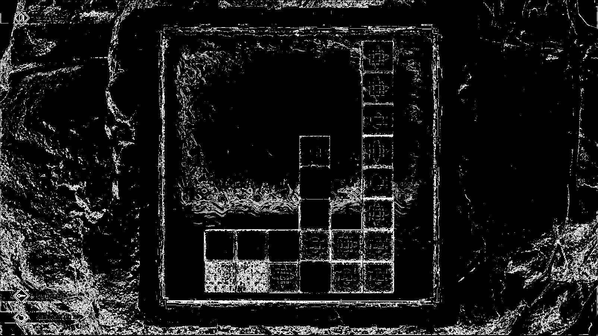
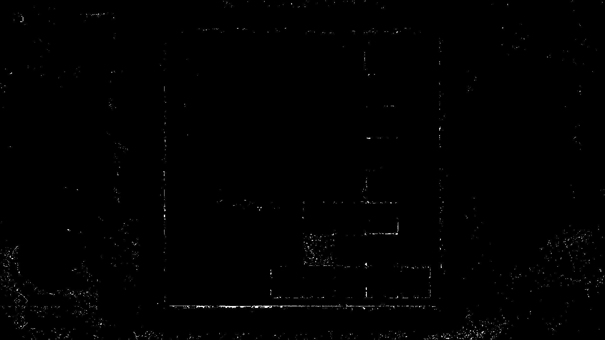
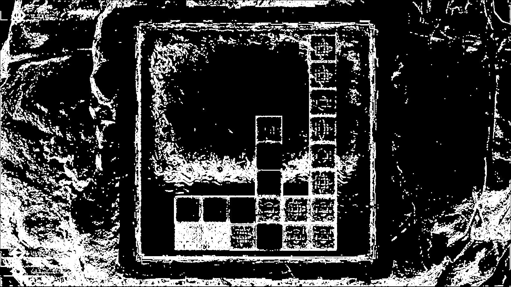

# Match Three Solver

This project is designed for grid detection in the match-three puzzle game [Islands of Insight](https://store.steampowered.com/app/2071500/Islands_of_Insight/). It solves 

## Program Overview

### What does the program do?

The program processes a screenshot of the puzzle by performing the following steps:

1. **Image Scaling**: The image is scaled down based on the input.
2. **Grayscale Conversion**: The image is converted to grayscale to simplify processing.
3. **Blurring**: A blur is applied to the image to reduce noise.
4. **Gradient Calculation**: Gradients are calculated to detect edges.
5. **Thresholding**: Thresholding is applied to the gradient to highlight key features.
6. **Erosion and Dilation**: Erosion and dilation are used to refine the edges and reduce noise.
7. **Line Detection**: The Hough Line Transform algorithm is applied to detect vertical and horizontal lines.

### Images Generated in the Process

Here are the images generated step by step during the program’s execution:

1. **Input Image**:

   

2. **Grayscaled Image**:

   

3. **Blurred Image**:

   

4. **Gradient Image**:

   

5. **Threshold Gradient Image**:

   

6. **Eroded Image**:

   

7. **Dilated Image**:

   

8. **Lines on Polar Coordinate Graph**:

   

9. **Hough Line Transform Image**:

   

10. **Output Image**:

   

## Running the Program

To run the program, you need to have the [Java Development Kit (JDK)](https://www.oracle.com/java/technologies/downloads/) installed on your computer. Once installed, follow these steps:

1. **Compile the Program**: Open your terminal and run the following command:
```bash
javac Main.java
```
2. **Run the Program**:
```bash
java Main
```

To change scaling for faster but more inaccurate line detection or to change input, you can change the main function, save it, compile and run the program.

## Usage in Other Programs

If you want to use the functions from this project in other programs, you can download the compiled `.jar` files. Once downloaded, you can include it as a dependency in your project and call the available functions as needed.


## Authors

- [@hampter-o7](https://www.github.com/hampter-o7)


## License

[MIT](https://choosealicense.com/licenses/mit/)