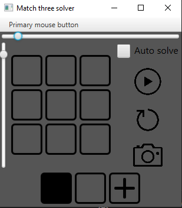

# Match Three Solver

This project is a match-three puzzle solver for the game [Islands of Insight](https://store.steampowered.com/app/2071500/Islands_of_Insight/).

## Program Overview

### What Does the Program Do?

The program is designed to solve match-three puzzles, primarily for speed challenges in *Islands of Insight*. It captures a screenshot, identifies the puzzle, displays it in a GUI, calculates a solution, and inputs the solution back into the game.

## Running the Program

To run the program:

1. Download the [.zip file](https://github.com/hampter-o7/match_three_solver/releases).
2. Unzip the contents.
3. Double-click the `runMe.bat` file to launch the application.

### Interface Features

- The two sliders adjust the width and height of the puzzle.
- The grid in the middle represents the puzzle to be solved.
- The first two "colors" at the bottom of the GUI are:
  - **Black**: for immovable blocks
  - **Gray/Background**: for empty cells
- You can add new colors by clicking the **plus** icon and selecting a color. Once selected, the color becomes active for painting the grid and is added to the bottom row for reuse.
- **Play button**: Calculates a solution for the current puzzle.
- **Reset button**: Resets the application to its initial state.
- **Camera button**: Takes a screenshot of the puzzle, populates the grid, and calculates the solution.
- **Auto Solve**: When enabled, this feature automatically inputs the solution after it's calculated (via the Play or Camera buttons). It's primarily intended for use in speed challenges.
- You can also configure the primary mouse button used for autosolve actions.

## Known Issues

- Automatic puzzle recognition from screenshots is approximately 70% accurate.
- Some puzzles may take a long time to solve.
- Currently, only 1920x1080 resolution and first monitor is supported for screenshots.
- Currently, only speed challenge puzzles are supported for screenshots.
- The program is only supported on Windows.

## Author

- [@hampter-o7](https://www.github.com/hampter-o7)

## License

This project is licensed under the [MIT License](https://choosealicense.com/licenses/mit/).
